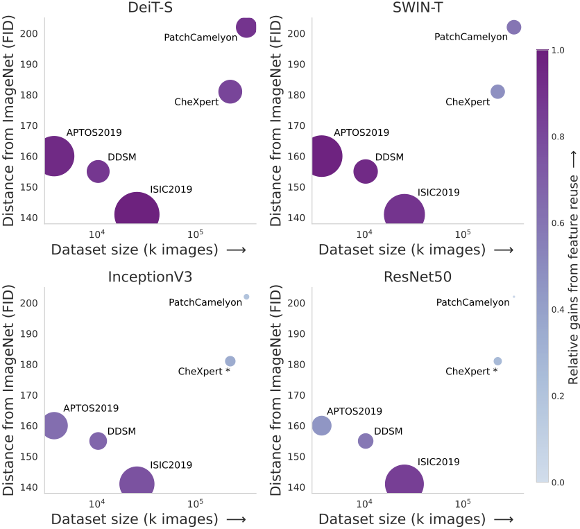

# [What Makes Transfer Learning Work For Medical Images: <br /> Feature Reuse \& Other Factors](https://arxiv.org/abs/2203.01825)

***CVPR 2022***

Transfer learning is a standard technique to transfer knowledge from one domain to another. 
For applications in medical imaging, transfer from ImageNet has become the de-facto approach, despite differences in the tasks and image characteristics between the domains.
However, it is unclear what factors determine whether -- and to what extent -- transfer learning to the medical domain is useful.
The long-standing assumption that features from the source domain get reused has recently been called into question. 
Through a series of experiments on several medical image benchmark datasets, we explore the relationship between transfer learning, data size, the capacity and inductive bias of the model, as well as the distance between the source and target domain.
Our findings suggest that transfer learning is beneficial in most cases, and we characterize the important role feature reuse plays in its success.

<hr style="border:2px solid blue"> </hr>


<b>Factors affecting the utility of transfer learning from ImageNet to medical domains.</b><br /> The size of each dot represents relative increase in performance  achieved transferring weights   from ImageNet (WT) compared to random initialization (RI). The color of the dot indicates how much of the gain can be attributed to feature reuse (relative gains , normalized between the minimum and the maximum value for all settings. Each panel shows the gains observed by a different model over five runs, in order of increasing inductive biases: DeiT-S, SWIN, Inception and ResNet50. The benefits from transfer learning increase with (1) reduced data size,  (2)  smaller  distances  between  the  source  and  target domain, and (3) less inductive bias. Moreover, feature reuse correlates strongly with observed gains from transfer learning, suggesting that feature reuse plays an essential role - especially for ViTs which lack the inductive biases of CNNs.

<br clear="left"/>
<hr style="border:2px solid blue"> </hr>

## Enviroment setup
To build using the docker file use the following command \
```docker build -f Dockerfile -t tl_img \``` \
```              --build-arg UID=$(id -u) \``` \
```              --build-arg GID=$(id -g) \``` \
```              --build-arg USER=$(whoami) \``` \
```              --build-arg GROUP=$(id -g -n) .```

## Usage:
* Training: ```python classification.py```
* Testing (using json file): ```python classification.py --test```
* Testing (using saved checkpoint): ```python classification.py --checkpoint CheckpointName --test```
* Fine tune the learning rate: ```python classification.py --lr_finder```
#### Usage for ablations:
* Test using k-nn: ```python classification.py --knn```
* Test using k-nn (layer-wise): ```python classification.py --layerwise_knn```
* Evaluate the resilience of each layer to re-initialization (layer-wise): ```python classification.py --layer_importance```
* Compute the l2 distance between the initial and the final state (layer-wise): ```python classification.py --l2```
* Calculate the feature similarity using CKA between the initial and the final state (layer-wise): ```python classification.py --layerwise_knn```
* Calculate the feature similarity using CKA between WT and ST (layer-wise): ```python classification.py --layerwise_knn --cross_wtst```


## Configuration (json file)

* dataset_params
  * dataset: Name of the dataset (APTOS2019, DDSM, ISIC2019, CheXpert, Camelyon)
  * data_location: Location that the datasets are located
  * train_transforms: Defines the augmentations for the training set
  * val_transforms: Defines the augmentations for the validation set
  * test_transforms: Defines the augmentations for the test set
* dataloader_params: Defines the dataloader parameters (batch size, num_workers etc)
* model_params
  * backbone_type: type of the backbone model (e.g. resnet50, deit_small)
  * transformers_params: Additional hyperparameters for the transformers
    * img_size: The size of the input images
    * patch_size: The patch size to use for patching the input
    * pretrained_type: If ```supervised``` it loads ImageNet weights that come from supervised learning.
  * pretrained: If True, it uses ImageNet pretrained weights
  * freeze_backbone: If True, it freezes the backbone network
* optimization_params: Defines learning rate, weight decay, learning rate schedule etc.  
  * optimizer: The default optimizer's parameters
    * type: The optimizer's type
    * autoscale_rl: If True it scales the learning rate based on the bach size
    * params: Defines the learning rate and the weght decay value
  * LARS_params: If use=True and bach size >= batch_act_thresh it uses LARS as optimizer
  * scheduler: Defines the learning rate schedule
    * type: A list of schedulers to use
    * params: Sets the hyperparameters of the optimizers
* training_params: Defines the training parameters
  * model_name: The model's name
  * val_every: Sets the frequency of the valiidation step (epochs - float)
  * log_every: Sets the frequency of the logging (iterations - int)
  * save_best_model: If True it will save the bast model based on the validation metrics
  * log_embeddings: If True it creates U-maps on each validation step
  * knn_eval: If True, during validation it will also calculate the scores based on knn evalutation
  * grad_clipping: If > 0, it clips the gradients
  * use_tensorboard: If True, it will use tensorboard for logging instead of wandb
  * use_mixed_precision: If True, it will use mixed precision 
  * save_dir: The dir to save the model's checkpoints etc.
* system_params: Defines if GPUs are used, which GPUs etc.
* log_params: Project and run name for the logger (we are using [Weights & Biases](https://www.wandb.com/) by default)
* lr_finder: Define the learning rate parameters
  * grid_search_params
    * min_pow, min_pow: The min and max power of 10 for the search
    * resolution: How many different learning rates to try
    * n_epochs: maximum epochs of the training session
    * random_lr: If True, it uses random learning rates withing the accepted range
    * keep_schedule: If True, it keeps the learning rate schedule
    * report_intermediate_steps: If True, it logs if validates throughout the training sessions
